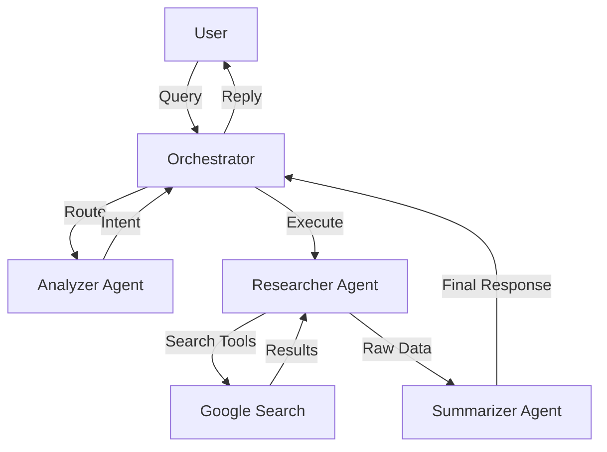

# LegalAdviser-AI

**LegalAdviser-AI** is an advanced AI-powered legal assistant designed to help Indian citizens understand their rights and navigate the legal system. It covers a wide range of Indian laws, including the **RTI Act**, **IPC**, **CrPC**, **BNS**, **Negotiable Instruments Act**, and more.

> **Note**: This project is a submission for the **Kaggle Agents Intensive Capstone Project** (Track: Agents for Good).

## 🚀 Key Features
*   **Comprehensive Legal Research**: Queries multiple Indian laws (IPC, CrPC, BNS, RTI, etc.) to provide accurate information.
*   **Source Prioritization**: Prioritizes authoritative sources like `devgan.in` and `indiankanoon.org` for legal queries.
*   **Actionable Advice**: Provides practical steps, such as how to file an RTI or a police complaint.
*   **Case Law Citations**: Cites relevant Supreme Court and High Court judgments.
*   **Chat History**: Keeps track of your recent consultations for easy reference (stored locally).

## 🧠 How It Works

LegalAdviser-AI uses an intelligent agentic workflow powered by **Google ADK** and **Gemini 2.5 Flash**:

1.  **Analyze**: The **Analyzer Agent** understands your query and determines if you need legal advice, clarification, or general information.
2.  **Research**: The **Research Agent** searches the web, prioritizing legal databases like `devgan.in` and `indiankanoon.org` to find specific Acts, Sections, and Judgments.
3.  **Synthesize**: The **Summarizer Agent** compiles the gathered facts into a clear, actionable response with citations.

### Architecture



## 💡 Example Queries
Try asking **LegalAdviser-AI** these questions:
*   *"What is the punishment for Section 302 IPC?"*
*   *"How do I file an RTI application for a delayed passport?"*
*   *"My cheque bounced. What legal action can I take under the Negotiable Instruments Act?"*
*   *"Explain the difference between Culpable Homicide and Murder."*
*   *"What are the grounds for divorce under the Hindu Marriage Act?"*

## 🛠️ Tech Stack
*   **Backend**: [FastAPI](https://fastapi.tiangolo.com/) (Python)
*   **AI Agent**: [Google ADK](https://github.com/google/project-idx-ai-agents) (Agent Development Kit)
*   **LLM**: [Google Gemini 2.5 Flash](https://ai.google.dev/)
*   **Search**: Google Search (via ADK)
```

## 🚀 Getting Started

### Prerequisites
*   Python 3.11+
*   Google Gemini API Key

### Installation

1.  **Clone the repository**:
    ```bash
    git clone https://github.com/yourusername/LegalAdviser-AI.git
    cd LegalAdviser-AI
    ```

2.  **Install Dependencies**:
    ```bash
    pip install -r requirements.txt
    ```

3.  **Set up Environment Variables**:
    Create a `.env` file in the root directory:
    ```env
    GOOGLE_API_KEY=your_gemini_api_key_here
    ```

### Running the Application

Start the server using Uvicorn:
```bash
uvicorn main:app --reload
```

Open your browser and navigate to: **http://127.0.0.1:8000**

## ❓ Troubleshooting
*   **`ModuleNotFoundError: No module named 'google.adk'`**: Ensure you have installed the dependencies using `pip install -r requirements.txt`.
*   **API Key Error**: Make sure your `GOOGLE_API_KEY` is correctly set in the `.env` file.
*   **Search Results Empty**: The agent relies on Google Search. Ensure you have an active internet connection.

## 🤝 Contributing
Contributions are welcome! Please feel free to submit a Pull Request.

## 📜 License
This project is open-source and available under the MIT License.

---
*Empowering Citizens with Information.*