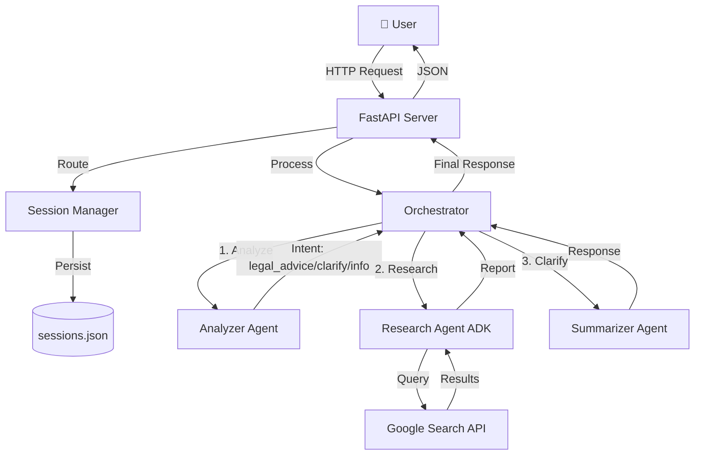

# 🏛️ LegalAdviser-AI

**Your AI-Powered Legal Companion for India**

[](https://opensource.org/licenses/MIT)
[](https://www.python.org/downloads/)
[](https://fastapi.tiangolo.com/)
[](https://ai.google.dev/)

**LegalAdviser‑AI** (branded as **CivicAI**) is an AI‑powered legal assistant that makes Indian law instantly accessible. It leverages **Google Gemini 2.5 Flash** and the **Google ADK** to provide concise, actionable legal advice, case‑law citations, and RTI‑application guidance.

---

## 📑 Table of Contents

- [Overview](#-overview)
- [Key Features](#-key-features)
- [Architecture](#-architecture)
- [Installation](#-installation)
- [Usage](#-usage)
- [Project Structure](#-project-structure)
- [API Documentation](#-api-documentation)
- [Configuration](#-configuration)
- [Development](#-development)
- [Deployment](#-deployment)
- [Troubleshooting](#-troubleshooting)
- [Contributing](#-contributing)
- [License](#-license)
- [Acknowledgments](#-acknowledgments)
- [Contact & Support](#-contact--support)

---

## 🎯 Overview

LegalAdviser‑AI is built for **anyone** who needs quick, reliable legal information:
- **Citizens** can ask about statutes, procedures, and RTI filing.
- **Lawyers** get fast case‑law references.
- **Developers** can extend the platform with custom agents or tools.

The system follows a **multi‑agent architecture** (Analyzer → Researcher → Summarizer) and maintains conversation context across sessions.

---

## ✨ Key Features

| Feature | Description |
|---|---|
| **Intent Detection** | Analyzer agent classifies queries (`legal_advice`, `clarify`, `info`). |
| **Legal Research** | Researcher agent performs targeted Google searches on authoritative sources (indiankanoon.org, devgan.in). |
| **Summarization** | Summarizer crafts concise, step‑by‑step responses with case‑law citations. |
| **Session Persistence** | Disk‑based JSON storage (`sessions.json`) with automatic cleanup after 24 h of inactivity. |
| **Observability** | Structured tracing and logging via `utils.tracing`. |
| **Web UI** | Responsive chat interface built with TailwindCSS and modern UI patterns. |
| **Docker Support** | Ready‑to‑run container image and Docker‑Compose configuration. |
| **Extensible Tools** | Framework for custom tools (e.g., legal‑database query, PDF generation). |

---

## 🏗️ Architecture



---

## 🚀 Installation

### Prerequisites
- **Python 3.11+**
- **Git** (optional, for cloning)
- **Docker** (optional, for container deployment)

### Steps (Windows example)
```powershell
# Clone the repository
git clone https://github.com/yourusername/LegalAdviser-AI.git
cd LegalAdviser-AI

# Create a virtual environment
python -m venv venv
venv\Scripts\activate

# Install dependencies
pip install -r requirements.txt

# Set up environment variables
copy .env.example .env
# Edit .env and add your GOOGLE_API_KEY

# Run the application
uvicorn main:app --reload
```
Open your browser at `http://127.0.0.1:8000/chat`.

---

## 💻 Usage

### Web UI
- Navigate to `/chat`.
- Type a legal question (e.g., *"What are the penalties for theft under IPC?"*).
- The assistant will respond with a concise answer and relevant case citations.

### API
All endpoints are documented at `http://127.0.0.1:8000/docs`.

```bash
curl -X POST http://127.0.0.1:8000/chat \
  -H "Content-Type: application/json" \
  -d '{"message": "What is Section 302 IPC?", "session_id": null}'
```

---

## 📁 Project Structure

```
LegalAdviser-AI/
├── agents/                # Agent implementations
│   ├── analyzer.py
│   ├── researcher.py
│   ├── summarizer.py
│   └── README.md          # Agent documentation (see below)
├── utils/                 # Reusable utilities
│   ├── session.py
│   ├── tracing.py
│   └── README.md          # Utils documentation (see below)
├── tools/                 # Custom tool framework
│   ├── base.py
│   └── README.md          # Tools documentation (see below)
├── templates/            # Jinja2 HTML templates
│   ├── base.html
│   ├── chat.html
│   └── index.html
├── static/               # CSS, JS, images
├── main.py               # FastAPI entry point
├── orchestrator.py       # Agent orchestration logic
├── dtos.py               # Pydantic models
├── requirements.txt
├── Dockerfile
├── docker-compose.yml
├── sessions.json         # Auto‑generated session store
└── README.md            # **This file**
```

Each sub‑directory contains its own `README.md` with focused documentation (linked above).

---

## 📖 API Documentation

The OpenAPI spec is automatically generated. Key endpoints:
- `POST /chat` – Send a user query.
- `GET /chat/{session_id}/history` – Retrieve conversation history.
- `GET /sessions/{session_id}` – Get session metadata.

See the interactive docs at `/docs` for request/response schemas.

---

## ⚙️ Configuration

| Variable | Description | Required | Default |
|---|---|---|---|
| `GOOGLE_API_KEY` | Gemini & ADK API key | ✅ | – |
| `PORT` | Server port (Docker) | ❌ | `8080` |
| `SESSION_TTL_HOURS` | Session cleanup threshold | ❌ | `24` |

All variables are read from the `.env` file at startup.

---

## 🛠️ Development

```bash
# Add a new agent
1. Create `agents/your_agent.py` extending the base class.
2. Register it in `orchestrator.py`.
3. Document it in `agents/README.md`.
```

---

## ☁️ Deployment

### Docker
```bash
# Build the image
docker build -t legaladviser-ai .
# Run the container
docker run -p 8080:8080 --env-file .env legaladviser-ai
```

### Docker‑Compose
```bash
docker-compose up --build
```

---

## 🔧 Troubleshooting

| Issue | Common Fix |
|---|---|
| `GOOGLE_API_KEY not found` | Ensure `.env` exists and contains a valid key. |
| Sessions disappear after restart | Verify `sessions.json` is writable and not corrupted. |
| Slow responses | Reduce `word_limit` in `researcher.py` or enable caching for frequent queries. |
| Empty search results | Check internet connectivity and API quota limits. |

Logs are printed to the console; adjust log level in `utils/tracing.py` if needed.

---

## 🤝 Contributing

Please read our [CONTRIBUTING.md](CONTRIBUTING.md) for the full guidelines. In short:
1. Fork the repo.
2. Create a feature branch (`git checkout -b feature/awesome-feature`).
3. Write tests for new functionality.
4. Run `black . && flake8 .`.
5. Submit a Pull Request.

---

## 📜 License

This project is licensed under the **MIT License** – see the [LICENSE](LICENSE) file for details.

---

## 🙏 Acknowledgments

- **Google Gemini** – for the powerful LLM.
- **Google ADK** – for seamless web‑search integration.
- **FastAPI** – for the lightweight API framework.
- **Indian legal databases** – `indiankanoon.org`, `devgan.in`.
- **Kaggle Agents Intensive** – the original inspiration.

---

## 📞 Contact & Support

- **Issues**: [GitHub Issues](https://github.com/yourusername/LegalAdviser-AI/issues)
- **Discussions**: [GitHub Discussions](https://github.com/yourusername/LegalAdviser-AI/discussions)
- **Email**: support@legaladviser.ai

---

<div align="center">

**Made with ❤️ for India**

*Empowering citizens with legal knowledge, one query at a time.*

⭐ Star this repo if you find it useful!

