```mermaid
graph TB
    User[👤 User] -->|HTTP Request| FastAPI[FastAPI Server]
    FastAPI -->|Route| SessionMgr[Session Manager]
    SessionMgr -->|Persist| JSON[(sessions.json)]
    FastAPI -->|Process| Orchestrator[Orchestrator]
    
    Orchestrator -->|1. Analyze| Analyzer[Analyzer Agent]
    Analyzer -->|Intent: legal_advice/clarify/info| Orchestrator
    
    Orchestrator -->|2. Research| Researcher[Research Agent ADK]
    Researcher -->|Query| GoogleSearch[Google Search API]
    GoogleSearch -->|Results| Researcher
    Researcher -->|Report| Orchestrator
    
    Orchestrator -->|3. Clarify| Summarizer[Summarizer Agent]
    Summarizer -->|Response| Orchestrator
    
    Orchestrator -->|Final Response| FastAPI
    FastAPI -->|JSON| User
```

# 🏛️ LegalAdviser-AI

<div align="center">

**Your AI-Powered Legal Companion for India**

[](https://opensource.org/licenses/MIT)
[](https://www.python.org/downloads/)
[](https://fastapi.tiangolo.com/)
[](https://ai.google.dev/)

*Empowering Citizens with Legal Knowledge*

[Features](#-key-features) •
[Demo](#-demo) •
[Installation](#-installation) •
[Documentation](#-documentation) •
[Contributing](#-contributing)

</div>

---

## 📋 Table of Contents

- [Overview](#-overview)
- [Key Features](#-key-features)
- [Architecture](#-architecture)  
- [Demo](#-demo)
- [Installation](#-installation)
- [Usage](#-usage)
- [Project Structure](#-project-structure)
- [API Documentation](#-api-documentation)
- [Configuration](#%EF%B8%8F-configuration)
- [Development](#-development)
- [Deployment](#-deployment)
- [Troubleshooting](#-troubleshooting)
- [Contributing](#-contributing)
- [License](#-license)
- [Acknowledgments](#-acknowledgments)

---

## 🎯 Overview

**LegalAdviser-AI** is an advanced AI-powered legal assistant designed to make Indian law accessible to everyone. Built with **Google's ADK** and **Gemini 2.5 Flash**, it provides instant answers to legal questions, cites relevant case law, and offers actionable advice.

### What Makes It Special?

- 🔍 **Intelligent Search**: Prioritizes authoritative sources like `indiankanoon.org` and `devgan.in`
- 📚 **Comprehensive Coverage**: IPC, CrPC, BNS, RTI Act, Motor Vehicles Act, and more
- ⚡ **Fast & Accurate**: Powered by Gemini 2.5 Flash for quick responses
- 💬 **Conversational AI**: Natural language understanding with conversation history
- 📖 **Case Law Citations**: Provides 2-3 relevant court judgments with every legal advice
- 🎯 **Actionable Steps**: Clear, step-by-step guidance (not just theory)

> **Note**: This project was created as a submission for the **Kaggle Agents Intensive Capstone Project** (Track: Agents for Good).

---

## ✨ Key Features

### For Users

| Feature | Description |
|---------|-------------|
| **Legal Analysis** | Get detailed breakdowns of IPC sections, CrPC procedures, and BNS provisions |
| **Case Law Search** | Find relevant Supreme Court and High Court judgments |
| **RTI Assistance** | Step-by-step guidance on filing RTI applications |
| **Document Help** | Understand legal notices and contracts in simple language |
| **Conversation History** | Sessions persist across server restarts |
| **Auto-Cleanup** | Old sessions automatically deleted after 24 hours of inactivity |

### For Developers

- 🏗️ **Multi-Agent Architecture**: Modular design with Analyzer, Researcher, and Summarizer agents
- 🔄 **Session Management**: Disk-based persistence with JSON storage
- 📊 **Tracing & Logging**: Built-in observability for debugging
- 🔐 **Input Validation**: Prevents malformed requests and API abuse
- 🎨 **Modern UI**: Beautiful, responsive interface with TailwindCSS

---

## 🏛️ Architecture

### System Design



### Agent Workflow

1. **Analyzer Agent** 🔍
   - Analyzes user query to determine intent (`legal_advice`, `clarify`, or `info`)
   - Generates optimized search queries for legal databases
   - Prioritizes `indiankanoon.org` and `devgan.in` for case law

2. **Research Agent** 📚 (Google ADK)
   - Executes web searches using Google Search tool
   - Finds relevant Acts, Sections, and court judgments
   - Extracts key facts and citations
   - Maintains conversation context via ADK sessions

3. **Summarizer Agent** ✍️
   - Synthesizes research into clear, actionable advice
   - Explains legal concepts in simple English
   - Provides 2-3 step-by-step actions

---

## 🎬 Demo

### Example Queries

**Query**: "The police refused to file my FIR. What can I do?"

**Response**:
> Under **Section 154 CrPC**, police are legally obligated to register an FIR for cognizable offenses. If refused:
> 
> 1. **Send written complaint** via registered post to the Station House Officer
> 2. **File complaint with Superintendent of Police** if still refused
> 3. **Approach Magistrate** under Section 156(3) CrPC to direct police to register FIR
>
> **Case Example**: In *Lalita Kumari vs. Govt. of UP (2014)*, the Supreme Court held that police have no discretion in registering FIR for cognizable offenses.

---

## 🚀 Installation

### Prerequisites

- **Python**: 3.11 or higher
- **Google Gemini API Key**: Get it from [Google AI Studio](https://makersuite.google.com/app/apikey)
- **pip**: Latest version recommended

### Quick Start

1. **Clone the repository**:
   ```bash
   git clone https://github.com/yourusername/LegalAdviser-AI.git
   cd LegalAdviser-AI
   ```

2. **Create virtual environment** (recommended):
   ```bash
   python -m venv venv
   
   # Windows
   venv\Scripts\activate
   
   # macOS/Linux
   source venv/bin/activate
   ```

3. **Install dependencies**:
   ```bash
   pip install -r requirements.txt
   ```

4. **Set up environment variables**:
   
   Create a `.env` file in the root directory:
   ```env
   GOOGLE_API_KEY=your_gemini_api_key_here
   ```

5. **Run the application**:
   ```bash
   uvicorn main:app --reload
   ```

6. **Open your browser** and navigate to:
   - **Web UI**: http://127.0.0.1:8000
   - **Chat Interface**: http://127.0.0.1:8000/chat
   - **API Docs**: http://127.0.0.1:8000/docs

---

## 📖 Usage

### Web Interface

1. Navigate to http://127.0.0.1:8000/chat
2. Type your legal  question
3. Get instant, AI-powered advice with case law citations
4. Continue the conversation - context is maintained!

### API Usage

```python
import requests

response = requests.post("http://127.0.0.1:8000/chat", json={
    "message": "What is Section 302 IPC?",
    "session_id": None  # Will create new session
})

print(response.json())
```

**Response**:
```json
{
  "reply": "Section 302 IPC deals with punishment for murder...",
  "analysis": {
    "intent": "info",
    "key_facts": ["IPC Section 302", "Punishment for murder"],
    "relevant_judgments": [...]
  },
  "session_id": "abc-123",
  "session_title": "What is Section 302 IPC?"
}
```

---

## 📁 Project Structure

```
LegalAdviser-AI/
├── agents/                    # AI Agent modules
│   ├── __init__.py
│   ├── analyzer.py           # Intent analysis & query optimization
│   ├── researcher.py         # Web research using Google ADK
│   ├── summarizer.py         # Response generation
│   └── README.md             # Agent documentation
├── utils/                     # Utility modules
│   ├── __init__.py
│   ├── session.py            # Session management with disk persistence
│   ├── tracing.py            # Logging & observability
│   └── README.md             # Utils documentation
├── tools/                     # Custom tools (extensible)
│   ├── __init__.py
│   ├── base.py               # Abstract base class for tools
│   └── README.md             # Tools documentation
├── templates/                 # Jinja2 HTML templates
│   ├── base.html             # Base layout
│   ├── index.html            # Landing page
│   ├── chat.html             # Chat interface
│   ├── about.html            # About page
│   └── README.md             # Template documentation
├── static/                    # Static assets
│   ├── css/
│   │   └── style.css         # Custom styles
│   ├── js/
│   │   └── chat.js           # Chat interface logic
│   └── images/               # Images and icons
├── main.py                    # FastAPI application entry point
├── orchestrator.py            # Agent orchestration logic
├── dtos.py                    # Data transfer objects (Pydantic models)
├── requirements.txt           # Python dependencies
├── .env.example               # Environment variables template
├── Dockerfile                 # Docker configuration
├── docker-compose.yml         # Docker Compose setup
├── sessions.json              # Session data (auto-generated)
├── README.md                  # This file
├── API.md                     # API documentation
├── CONTRIBUTING.md            # Contributing guidelines
└── LICENSE                    # MIT License
```

See individual `README.md` files in each directory for detailed documentation.

---

## 📡 API Documentation

### Endpoints

#### `POST /chat`
Submit a legal query and get AI-powered response.

**Request Body**:
```json
{
  "message": "string (required, max 5000 chars)",
  "session_id": "string (optional)"
}
```

**Response**:
```json
{
  "reply": "string",
  "analysis": {
    "intent": "legal_advice | clarify | info",
    "search_queries": ["string"],
    "key_facts": ["string"],
    "relevant_judgments": [{"title": "...", "url": "...", "snippet": "...", "source": "..."}],
    "reasoning": "string",
    "priority_domains": ["string"]
  },
  "session_id": "string",
  "session_title": "string"
}
```

#### `GET /chat/{session_id}/history`
Retrieve chat history for a session.

**Response**: Array of message objects

#### `GET /sessions/{session_id}`
Get session metadata.

**Response**:
```json
{
  "session_id": "string",
  "title": "string"
}
```

For complete API documentation, visit http://127.0.0.1:8000/docs after starting the server.

---

## ⚙️ Configuration

### Environment Variables

| Variable | Description | Required | Default |
|----------|-------------|----------|---------|
| `GOOGLE_API_KEY` | Google Gemini API key | ✅ Yes | - |
| `PORT` | Server port (for Docker) | ❌ No | 8080 |

### Agent Configuration

Modify agent behavior in their respective files:

- **Word Limit**: `agents/researcher.py` → Line 49 (currently 150 words)
- **Case Examples**: `agents/researcher.py` → Line 53 (currently 2-3 examples)
- **Session TTL**: `main.py` → Line 29 (currently 24 hours)

---

## 💻 Development

### Running Tests

```bash
# Install test dependencies
pip install pytest pytest-asyncio httpx

# Run tests
pytest tests/
```

### Code Formatting

```bash
# Install formatters
pip install black flake8

# Format code
black .

# Lint
flake8 .
```

### Adding a New Agent

1. Create file in `agents/your_agent.py`
2. Inherit from appropriate base class
3. Register in `orchestrator.py`
4. Document in `agents/README.md`

See `agents/README.md` for details.

---

## 🚢 Deployment

### Docker

```bash
# Build image
docker build -t legaladviser-ai .

# Run container
docker run -p 8080:8080 --env-file .env legaladviser-ai
```

### Docker Compose

```bash
docker-compose up
```

### Google Cloud Run

```bash
# Authenticate
gcloud auth login

# Build and push
gcloud builds submit --tag gcr.io/YOUR_PROJECT_ID/legaladviser-ai

# Deploy
gcloud run deploy legaladviser-ai \
  --image gcr.io/YOUR_PROJECT_ID/legaladviser-ai \
  --platform managed \
  --region us-central1 \
  --set-env-vars GOOGLE_API_KEY=your_key
```

---

## 🔧 Troubleshooting

### Common Issues

**Error: `GOOGLE_API_KEY not found`**
- ✅ Ensure `.env` file exists in project root
- ✅ Check that `GOOGLE_API_KEY` is set correctly
- ✅ Restart the server after adding the key

**Error: `Session not found` (404)**
- Server was restarted and sessions were lost
- ✅ Sessions now persist to `sessions.json` - this should not happen anymore
- If it does, check file permissions on `sessions.json`

**Slow Response Times**
- ✅ Enable response caching (see `backend_review.md` for implementation)
- ✅ Reduce word limit in researcher prompt
- ✅ Limit number of search queries generated

**Empty Search Results**
- ✅ Check internet connection
- ✅ Verify Google API key has search permissions
- ✅ Check logs for API quota limits

### Logs

View detailed logs in the console where you ran `uvicorn`. Look for:
- `INFO: Loaded X sessions from disk` - Session restoration on startup
- `Created new ADK session: adk_{id}` - New conversation started
- `Using existing ADK session: adk_{id}` - Conversation continued

---

## 🤝 Contributing

Contributions are welcome! Please see [CONTRIBUTING.md](CONTRIBUTING.md) for guidelines.

### Quick Guidelines

1. Fork the repository
2. Create a feature branch (`git checkout -b feature/amazing-feature`)
3. Make your changes
4. Add tests if applicable
5. Commit your changes (`git commit -m 'Add amazing feature'`)
6. Push to the branch (`git push origin feature/amazing-feature`)
7. Open a Pull Request

---

## 📜 License

This project is licensed under the MIT License - see the [LICENSE](LICENSE) file for details.

---

## 🙏 Acknowledgments

- **Google Gemini Team** - For the powerful Gemini API
- **Google ADK Team** - For the Agent Development Kit
- **FastAPI** - For the amazing web framework
- **Indian Legal Community** - For open legal databases like IndianKanoon
- **Kaggle** - For the Agents Intensive course that inspired this project

### Built With

- [Google Gemini 2.5 Flash](https://ai.google.dev/)
- [Google ADK](https://github.com/google/project-idx-ai-agents)
- [FastAPI](https://fastapi.tiangolo.com/)
- [Pydantic](https://docs.pydantic.dev/)
- [Uvicorn](https://www.uvicorn.org/)
- [TailwindCSS](https://tailwindcss.com/)

---

## 📞 Contact & Support

- **Issues**: [GitHub Issues](https://github.com/yourusername/LegalAdviser-AI/issues)
- **Discussions**: [GitHub Discussions](https://github.com/yourusername/LegalAdviser-AI/discussions)

---

<div align="center">

**Made with ❤️ for India**

*Empowering citizens with legal knowledge, one query at a time.*

⭐ Star this repo if you find it useful!

</div>
