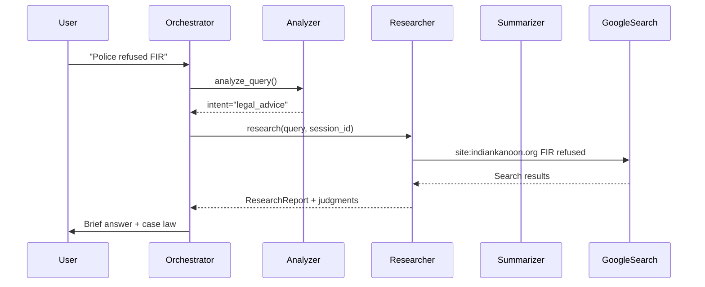

# Agents Module

This directory contains the AI agents that power LegalAdviser-AI's intelligent legal assistance.

## Overview

The multi-agent architecture divides responsibilities into specialized agents, each handling a specific aspect of query processing:

```
User Query
    ↓
Analyzer Agent (Intent Detection)
    ↓
Orchestrator (Routing)
    ↓
├─→ Research Agent (Legal Research)
│   
└─→ Summarizer Agent (Clarification)
```

---

## Agents

### 1. Analyzer Agent (`analyzer.py`)

**Purpose**: Analyzes user queries to determine intent and generate optimized search queries.

**Key Responsibilities**:
- Classifies intent as `legal_advice`, `clarify`, or `info`
- Generates keyword-optimized search queries
- Prioritizes authoritative sources (indiankanoon.org, devgan.in)
- Extracts key facts from search results

**Technology**: Google Gemini 2.5 Flash (direct API)

**Methods**:
- `analyze_query(query, history)` - Determines user intent
- `analyze_results(analysis, search_context, search_results)` - Extracts facts from search

**Configuration**:
```python
model = genai.GenerativeModel('gemini-2.5-flash')
```

---

### 2. Research Agent (`researcher.py`)

**Purpose**: Conducts web research using Google Search to find relevant legal information.

**Key Responsibilities**:
- Executes web searches via Google ADK
- Finds statutes, sections, and case law
- Cites relevant court judgments (2-3 per query)
- Maintains conversation context across queries

**Technology**: Google ADK (Agent Development Kit) + Google Search Tool

**Methods**:
- `research(query, history, user_session_id)` - Main research function
  - **Parameters**:
    - `query`: User's legal question
    - `history`: Previous conversation messages
    - `user_session_id`: Session ID for context continuity
  - **Returns**: `ResearchReport` with summary and judgments

**Session Management**:
- Creates ADK session as `adk_{user_session_id}`
- Reuses sessions to maintain conversation context
- Prevents "session lost" errors on follow-up queries

**Configuration**:
- **Model**: Gemini 2.5 Flash
- **Word Limit**: 150 words (configurable on line 49)
- **Case Examples**: 2-3 judgments (configurable on line 53)
- **Search Priority**: devgan.in for IPC/CrPC/BNS

**Prompt Engineering**:
The system prompt emphasizes:
- Brevity (under 150 words)
- Simple English (no jargon)
- Actionable steps (bullet points)
- Case law inclusion (2-3 examples)
- Inline citations

---

### 3. Summarizer Agent (`summarizer.py`)

**Purpose**: Synthesizes information for clarification queries.

**Key Responsibilities**:
- Asks clarifying questions when query is vague
- Provides general legal information
- Explains concepts in simple language

**Technology**: Google Gemini 2.5 Flash (direct API)

**Methods**:
- `summarize(query, analysis, history)` - Generates user-friendly response

**Use Cases**:
- When user query is too vague ("Tell me about law")
- General information requests
- Follow-up clarifications

---

## Data Flow



---

## Adding a New Agent

1. **Create agent file**: `agents/your_agent.py`

2. **Define agent class**:
```python
import google.generativeai as genai
import os

class YourAgent:
    def __init__(self):
        self.api_key = os.getenv("GOOGLE_API_KEY")
        if not self.api_key:
            raise ValueError("API key required")
        
        genai.configure(api_key=self.api_key)
        self.model = genai.GenerativeModel('gemini-2.5-flash')
    
    def process(self, query: str) -> str:
        prompt = f"Your custom prompt: {query}"
        response = self.model.generate_content(prompt)
        return response.text
```

3. **Register in orchestrator** (`orchestrator.py`):
```python
from agents.your_agent import YourAgent

class Orchestrator:
    def __init__(self):
        self.your_agent = YourAgent()
```

4. **Update routing logic**:
```python
if analysis.intent == "your_custom_intent":
    return await self._run_your_flow(query, analysis, history)
```

5. **Document** in this README

---

## Best Practices

### Prompt Engineering
- Keep prompts focused and specific
- Use structured output (JSON) when possible
- Include examples in system prompts
- Limit response length to avoid timeouts

### Error Handling
- Always validate API keys in `__init__`
- Catch and log exceptions
- Provide fallback responses
- Don't expose internal errors to users

### Performance
- Cache frequently requested information
- Batch API calls when possible
- Use streaming for long responses
- Monitor token usage

---

## Troubleshooting

**Issue**: Agent responses are too verbose
- **Fix**: Reduce word limit in system prompt (line 49 in `researcher.py`)

**Issue**: Not enough case law examples
- **Fix**: Increase count in prompt (line 53 in `researcher.py`)

**Issue**: Search results irrelevant
- **Fix**: Improve search query generation in `analyzer.py`
  - Add more specific keywords
  - Use Boolean operators (AND, OR, site:)

**Issue**: Sessions not persisting
-**Fix**: Ensure `user_session_id` is passed through entire pipeline
  - Check `main.py` → `orchestrator.py` → `researcher.py`

---

## Configuration

### Environment Variables
- `GOOGLE_API_KEY`: Required for all agents

### Model Selection
To change the AI model, update in each agent:
```python
self.model = genai.GenerativeModel('gemini-2.0-flash-exp')  # Or any Gemini model
```

### Tracing
Agents use the `@trace_span` decorator for logging:
```python
from utils.tracing import trace_span

@trace_span("AgentName", "method_name")
def your_method(self, ...):
    # Implementation
```

Check logs for timing and error information.

---

## Dependencies

- `google-generativeai` - Direct Gemini API access
- `google-adk` - Agent Development Kit (for  Researcher)
- `pydantic` - Data validation for DTOs
- `python-dotenv` - Environment variable management

---

## Testing

Example test for Analyzer:

```python
import pytest
from agents.analyzer import AnalyzerAgent

def test_analyzer_legal_advice_intent():
    agent = AnalyzerAgent()
    result = agent.analyze_query("Police refused FIR", history=[])
    assert result.intent == "legal_advice"
    assert len(result.search_queries) > 0
```

Run tests:
```bash
pytest tests/test_agents.py
```

---

## Learn More

- [Google ADK Documentation](https://github.com/google/project-idx-ai-agents)
- [Gemini API Guide](https://ai.google.dev/docs)
- [Main Project README](../README.md)
