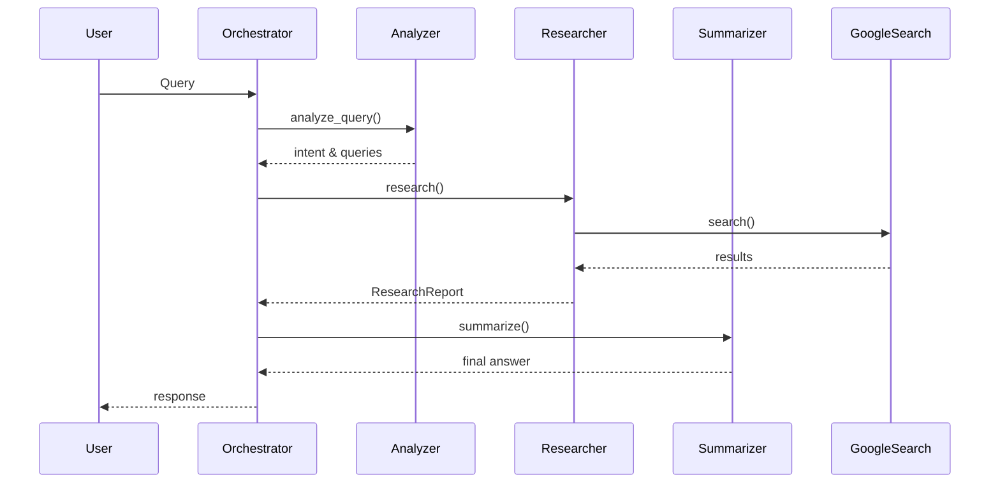

# 🤖 Agents Documentation

[](../README.md)

This directory contains the three core agents that power **LegalAdviser‑AI** (CivicAI). Each agent has a single responsibility and communicates through the orchestrator.

---

## 📂 Structure

- `analyzer.py` – Detects user intent and generates optimized search queries.
- `researcher.py` – Performs legal research via Google ADK and returns a structured report.
- `summarizer.py` – Turns the research report into a concise, actionable response.

---

## 🧠 Analyzer Agent (`analyzer.py`)

**Purpose**: Understand the user's query.

**Key Functions**:
- `analyze_query(query: str, history: list) -> AnalysisResult`
  - Classifies intent (`legal_advice`, `clarify`, `info`).
  - Generates a list of keyword‑rich search queries.
- `analyze_results(analysis, search_context, search_results) -> FactExtraction`
  - Extracts the most relevant facts from raw search results.

**Configuration**:
```python
model = genai.GenerativeModel('gemini-2.5-flash')
```

---

## 🔍 Researcher Agent (`researcher.py`)

**Purpose**: Retrieve authoritative legal information.

**Key Functions**:
- `research(query: str, history: list, user_session_id: str) -> ResearchReport`
  - Uses the Google ADK `google_search` tool.
  - Targets Indian legal sources (`indiankanoon.org`, `devgan.in`).
  - Returns a summary plus 2‑3 cited judgments.

**Configurable Parameters** (see the file for exact line numbers):
- **Word limit** – default 150 words.
- **Case examples** – default 2‑3 per query.
- **Search priority** – `devgan.in` for IPC/CrPC/BNS.

---

## ✍️ Summarizer Agent (`summarizer.py`)

**Purpose**: Produce the final user‑facing answer.

**Key Functions**:
- `summarize(query: str, analysis: AnalysisResult, history: list) -> str`
  - Generates a clear, step‑by‑step response.
  - Adds case‑law citations and actionable advice.

**Use‑Cases**:
- Vague queries (e.g., "Tell me about law").
- Follow‑up clarifications.
- General legal information.

---

## 🔄 Data Flow Diagram



---

## 📦 Adding a New Agent

1. Create `agents/your_agent.py` extending the base pattern.
2. Implement a clear `process` method.
3. Register the agent in `orchestrator.py`.
4. Update routing logic based on new intent.
5. Document the agent here.

---

## 🧪 Testing

```bash
pytest tests/test_agents.py
```

Typical tests cover intent detection, research output shape, and summarization quality.

---

## 📚 Further Reading

- [Main Project README](../README.md)
- [Google ADK Documentation](https://github.com/google/project-idx-ai-agents)
- [Gemini API Guide](https://ai.google.dev/docs)
